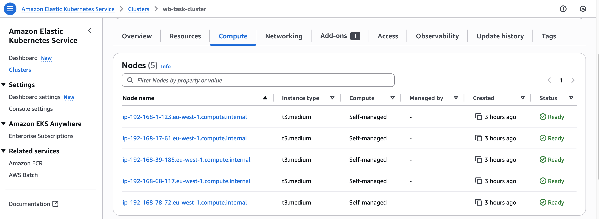
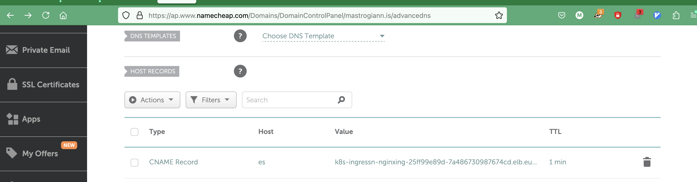
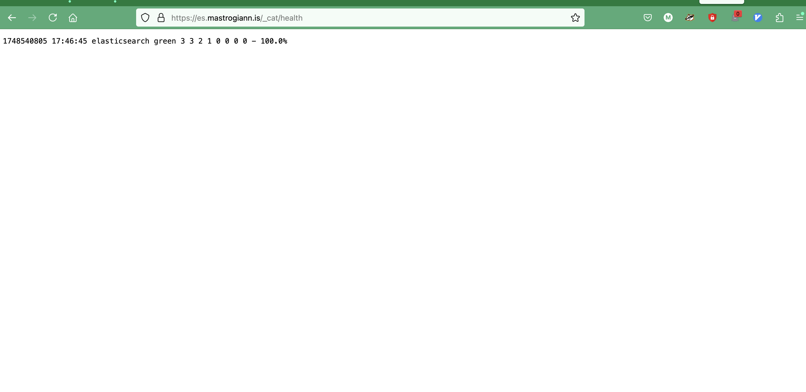

# Whalebone Case Study
### by Georgios Mastrogiannis

## Infrastructure Setup
- Use **AWS EKS** to create the kubernetes cluster for real-world experience.
- Since Elastic Search will need 3 dedicated nodes, I will create 2 additional nodes for any infra tools.
- **Tools Used:** AWS CLI, eksctl, kubectl, helm.

**AWS CLI Configuration:**  
`aws configure --profile aws-personal`  

**Creating the EKS Cluster with eksctl:**

Adding the taint and labels since we will need them later

`eksctl create cluster -f wb-task-cluster.yaml --profile aws-personal`  



---

## Apps Installation
### Create new StorageClass

Made it default and reclaim policy as Retain
```
georgiosmastrogiannis@Evas-MacBook-Pro k8s % kubectl apply -f elastic-storageclass.yaml
storageclass.storage.k8s.io/elastic-storageclass created
georgiosmastrogiannis@Evas-MacBook-Pro k8s % 
georgiosmastrogiannis@Evas-MacBook-Pro k8s % 
georgiosmastrogiannis@Evas-MacBook-Pro k8s % kubectl get storageClass               
NAME                             PROVISIONER             RECLAIMPOLICY   VOLUMEBINDINGMODE      ALLOWVOLUMEEXPANSION   AGE
elastic-storageclass (default)   ebs.csi.aws.com         Retain          WaitForFirstConsumer   true                   10s
gp2                              kubernetes.io/aws-ebs   Delete          WaitForFirstConsumer   false                  3h42m
```

### Create Elastic Search credentials secret

`kubectl create secret ...`
This kubernetes secret will be encrypted at rest, meaning in etcd, but still visible with kubectl as per documentation:

https://docs.aws.amazon.com/eks/latest/userguide/envelope-encryption.html


```
georgiosmastrogiannis@Evas-MacBook-Pro k8s % kubectl get secret -n elastic
NAME                                  TYPE                 DATA   AGE
elastic-credentials                   Opaque               2      29h
```

If time allows will introduce sealed secrets

### Install Elastic Search

Elastic Search pods land on the dedicated nodes and use the new storage class:

```
georgiosmastrogiannis@Evas-MacBook-Pro k8s % helm install elasticsearch elastic/elasticsearch \
  -n elastic \
  -f elastic-values.yaml
```

```
georgiosmastrogiannis@Evas-MacBook-Pro k8s % kubectl get pods -n elastic -o wide
NAME                     READY   STATUS    RESTARTS   AGE     IP               NODE                                           NOMINATED NODE   READINESS GATES
elasticsearch-master-0   1/1     Running   0          9m53s   192.168.36.154   ip-192-168-39-185.eu-west-1.compute.internal   <none>           <none>
elasticsearch-master-1   1/1     Running   0          10m     192.168.82.44    ip-192-168-78-72.eu-west-1.compute.internal    <none>           <none>
elasticsearch-master-2   1/1     Running   0          10m     192.168.1.60     ip-192-168-17-61.eu-west-1.compute.internal    <none>           <none>
georgiosmastrogiannis@Evas-MacBook-Pro k8s % 
georgiosmastrogiannis@Evas-MacBook-Pro k8s % 
georgiosmastrogiannis@Evas-MacBook-Pro k8s % 
georgiosmastrogiannis@Evas-MacBook-Pro k8s % 
georgiosmastrogiannis@Evas-MacBook-Pro k8s % kubectl get nodes -o custom-columns=NAME:.metadata.name,TAINTS:.spec.taints

NAME                                           TAINTS
ip-192-168-1-123.eu-west-1.compute.internal    <none>
ip-192-168-17-61.eu-west-1.compute.internal    [map[effect:NoSchedule key:dedicated value:elasticsearch]]
ip-192-168-39-185.eu-west-1.compute.internal   [map[effect:NoSchedule key:dedicated value:elasticsearch]]
ip-192-168-68-117.eu-west-1.compute.internal   <none>
ip-192-168-78-72.eu-west-1.compute.internal    [map[effect:NoSchedule key:dedicated value:elasticsearch]]
georgiosmastrogiannis@Evas-MacBook-Pro k8s % 
georgiosmastrogiannis@Evas-MacBook-Pro k8s % 
georgiosmastrogiannis@Evas-MacBook-Pro k8s % kubectl get nodes -l dedicated=elasticsearch --show-labels

NAME                                           STATUS   ROLES    AGE     VERSION                LABELS
ip-192-168-17-61.eu-west-1.compute.internal    Ready    <none>   5h44m   v1.30.11-eks-473151a   alpha.eksctl.io/cluster-name=wb-task-cluster,alpha.eksctl.io/instance-id=i-069e41c6b73892868,alpha.eksctl.io/nodegroup-name=es-nodes,beta.kubernetes.io/arch=amd64,beta.kubernetes.io/instance-type=t3.medium,beta.kubernetes.io/os=linux,dedicated=elasticsearch,failure-domain.beta.kubernetes.io/region=eu-west-1,failure-domain.beta.kubernetes.io/zone=eu-west-1a,k8s.io/cloud-provider-aws=ccf8b604b8038cc5aec106e14e7c564c,kubernetes.io/arch=amd64,kubernetes.io/hostname=ip-192-168-17-61.eu-west-1.compute.internal,kubernetes.io/os=linux,node-lifecycle=on-demand,node.kubernetes.io/instance-type=t3.medium,topology.ebs.csi.aws.com/zone=eu-west-1a,topology.k8s.aws/zone-id=euw1-az2,topology.kubernetes.io/region=eu-west-1,topology.kubernetes.io/zone=eu-west-1a
ip-192-168-39-185.eu-west-1.compute.internal   Ready    <none>   5h43m   v1.30.11-eks-473151a   alpha.eksctl.io/cluster-name=wb-task-cluster,alpha.eksctl.io/instance-id=i-0e57f6ca978e516a1,alpha.eksctl.io/nodegroup-name=es-nodes,beta.kubernetes.io/arch=amd64,beta.kubernetes.io/instance-type=t3.medium,beta.kubernetes.io/os=linux,dedicated=elasticsearch,failure-domain.beta.kubernetes.io/region=eu-west-1,failure-domain.beta.kubernetes.io/zone=eu-west-1b,k8s.io/cloud-provider-aws=ccf8b604b8038cc5aec106e14e7c564c,kubernetes.io/arch=amd64,kubernetes.io/hostname=ip-192-168-39-185.eu-west-1.compute.internal,kubernetes.io/os=linux,node-lifecycle=on-demand,node.kubernetes.io/instance-type=t3.medium,topology.ebs.csi.aws.com/zone=eu-west-1b,topology.k8s.aws/zone-id=euw1-az3,topology.kubernetes.io/region=eu-west-1,topology.kubernetes.io/zone=eu-west-1b
ip-192-168-78-72.eu-west-1.compute.internal    Ready    <none>   5h44m   v1.30.11-eks-473151a   alpha.eksctl.io/cluster-name=wb-task-cluster,alpha.eksctl.io/instance-id=i-04bf2ae2197427ac8,alpha.eksctl.io/nodegroup-name=es-nodes,beta.kubernetes.io/arch=amd64,beta.kubernetes.io/instance-type=t3.medium,beta.kubernetes.io/os=linux,dedicated=elasticsearch,failure-domain.beta.kubernetes.io/region=eu-west-1,failure-domain.beta.kubernetes.io/zone=eu-west-1c,k8s.io/cloud-provider-aws=ccf8b604b8038cc5aec106e14e7c564c,kubernetes.io/arch=amd64,kubernetes.io/hostname=ip-192-168-78-72.eu-west-1.compute.internal,kubernetes.io/os=linux,node-lifecycle=on-demand,node.kubernetes.io/instance-type=t3.medium,topology.ebs.csi.aws.com/zone=eu-west-1c,topology.k8s.aws/zone-id=euw1-az1,topology.kubernetes.io/region=eu-west-1,topology.kubernetes.io/zone=eu-west-1c
```

```
georgiosmastrogiannis@Evas-MacBook-Pro k8s % kubectl exec -n elastic elasticsearch-master-0 -- curl -k -u elastic:whalebone https://localhost:9200/_cat/health
Defaulted container "elasticsearch" out of: elasticsearch, configure-sysctl (init)
  % Total    % Received % Xferd  Average Speed   Time    Time     Time  Current
                                 Dload  Upload   Total   Spent    Left  Speed
100    65  100    65    0     0   2500      0 --:--:-- --:--:-- --:--:--  2500
1748444246 14:57:26 elasticsearch green 3 3 2 1 0 0 0 0 - 100.0%
```

🟢 is good

### Install Nginx ingress controller

```
georgiosmastrogiannis@Evas-MacBook-Pro k8s % helm install nginx-ingress ingress-nginx/ingress-nginx \
  --namespace ingress-nginx --create-namespace \
  --set controller.service.type=LoadBalancer \
  --set controller.service.annotations."service\.beta\.kubernetes\.io/aws-load-balancer-scheme"=internet-facing
```

Wait a bit until it's ready:

```
georgiosmastrogiannis@Evas-MacBook-Pro k8s % kubectl get service --namespace ingress-nginx nginx-ingress-ingress-nginx-controller                      
NAME                                     TYPE           CLUSTER-IP     EXTERNAL-IP                                                                     PORT(S)                      AGE
nginx-ingress-ingress-nginx-controller   LoadBalancer   10.100.105.3   k8s-ingressn-nginxing-25ff99e89d-7a486730987674cd.elb.eu-west-1.amazonaws.com   80:31743/TCP,443:31457/TCP   2m3s
```

### Create Ingress

`georgiosmastrogiannis@Evas-MacBook-Pro k8s % kubectl apply -f elastic-ingress.yaml`

```
georgiosmastrogiannis@Evas-MacBook-Pro k8s % kubectl get ingress -n elastic
NAME              CLASS    HOSTS               ADDRESS                                                                         PORTS     AGE
elastic-ingress   <none>   es.mastrogiann.is   k8s-ingressn-nginxing-25ff99e89d-7a486730987674cd.elb.eu-west-1.amazonaws.com   80, 443   80m
```

### Install cert-manager

`kubectl apply -f https://github.com/cert-manager/cert-manager/releases/latest/download/cert-manager.yaml`

```
georgiosmastrogiannis@Evas-MacBook-Pro k8s % kubectl get pods -n cert-manager

NAME                                       READY   STATUS    RESTARTS   AGE
cert-manager-6687d8765c-rvfrf              1/1     Running   0          14s
cert-manager-cainjector-764498cfc8-6tlkn   1/1     Running   0          14s
cert-manager-webhook-74c74b87d7-gnzmp      1/1     Running   0          14s
```

```georgiosmastrogiannis@Evas-MacBook-Pro k8s % kubectl apply -f cluster-issuer.yaml 
clusterissuer.cert-manager.io/letsencrypt-prod created
```

Make sure the cert is ready:

```
georgiosmastrogiannis@Evas-MacBook-Pro k8s % kubectl get certificate -n elastic
NAME                READY   SECRET              AGE
elasticsearch-tls   True    elasticsearch-tls   86m
```

and ingress is using the cluster-issuer:

```
georgiosmastrogiannis@Evas-MacBook-Pro k8s % kubectl describe ingress -n elastic
Name:             elastic-ingress
Labels:           <none>
Namespace:        elastic
Address:          k8s-ingressn-nginxing-25ff99e89d-7a486730987674cd.elb.eu-west-1.amazonaws.com
Ingress Class:    <none>
Default backend:  <default>
TLS:
  elasticsearch-tls terminates es.mastrogiann.is
Rules:
  Host               Path  Backends
  ----               ----  --------
  es.mastrogiann.is  
                     /   elasticsearch-master:9200 (192.168.1.60:9200,192.168.82.44:9200,192.168.36.154:9200)
Annotations:         cert-manager.io/cluster-issuer: letsencrypt-prod
                     kubernetes.io/ingress.class: nginx
                     nginx.ingress.kubernetes.io/backend-protocol: HTTPS
Events:              <none>
```

### Add DNS record



### Access Elastic Search

[es.mastrogiannis.is](https://es.mastrogiann.is)



🎉

---

## Improvements
- Introduce sealed secrets, so secrets are not visible anymore with kubectl and can be committed on git

```
georgiosmastrogiannis@Evas-MacBook-Pro k8s % kubectl apply -f https://github.com/bitnami-labs/sealed-secrets/releases/download/v0.25.0/controller.yaml
role.rbac.authorization.k8s.io/sealed-secrets-key-admin created
clusterrolebinding.rbac.authorization.k8s.io/sealed-secrets-controller created
clusterrole.rbac.authorization.k8s.io/secrets-unsealer created
customresourcedefinition.apiextensions.k8s.io/sealedsecrets.bitnami.com created
service/sealed-secrets-controller created
role.rbac.authorization.k8s.io/sealed-secrets-service-proxier created
rolebinding.rbac.authorization.k8s.io/sealed-secrets-controller created
serviceaccount/sealed-secrets-controller created
deployment.apps/sealed-secrets-controller created
rolebinding.rbac.authorization.k8s.io/sealed-secrets-service-proxier created
service/sealed-secrets-controller-metrics created
georgiosmastrogiannis@Evas-MacBook-Pro k8s % 
georgiosmastrogiannis@Evas-MacBook-Pro k8s % 
georgiosmastrogiannis@Evas-MacBook-Pro k8s % kubectl get pods -n kube-system | grep sealed-secrets
sealed-secrets-controller-649df66d59-6cg75      0/1     Running   0          10s
georgiosmastrogiannis@Evas-MacBook-Pro k8s % kubectl get pods -n kube-system | grep sealed-secrets -w
sealed-secrets-controller-649df66d59-6cg75      1/1     Running   0          29s
```

```
georgiosmastrogiannis@Evas-MacBook-Pro k8s % kubeseal --controller-name=sealed-secrets-controller --controller-namespace=kube-system \
  --format yaml < elasticsearch-master-credentials.yaml > elasticsearch-master-credentials-sealed.yaml
```

```
georgiosmastrogiannis@Evas-MacBook-Pro k8s % kubectl apply -f elasticsearch-master-credentials-sealed.yaml                                                 
sealedsecret.bitnami.com/elasticsearch-master-credentials created
```


----

## TSHOOT
- At my first attempt I created the cluster with t3.small nodes, to save money, but then noticed in the official docs Elastic Search pods need at least 2GB:

https://www.elastic.co/docs/deploy-manage/deploy/cloud-on-k8s/elasticsearch-deployment-quickstart

So I had to recreate the cluster with t3.medium which has 4GB

---

- After installing Elastic Search with helm chart, pods where in Pending:

```
georgiosmastrogiannis@Evas-MacBook-Pro k8s % kubectl get pods --namespace=elastic -l app=elasticsearch-master -w
NAME                     READY   STATUS    RESTARTS   AGE
elasticsearch-master-0   0/1     Pending   0          27s
elasticsearch-master-1   0/1     Pending   0          27s
elasticsearch-master-2   0/1     Pending   0          27s
```

After double checking taints, labels and resources I noticed these messages in the events:

```
4m22s Normal ExternalProvisioning persistentvolumeclaim/elasticsearch-master-elasticsearch-master-0 Waiting for a volume to be created either by the external provisioner 'ebs.csi.aws.com' or manually by the system administrator. If volume creation is delayed, please verify that the provisioner is running and correctly registered.

georgiosmastrogiannis@Evas-MacBook-Pro k8s % kubectl get events -n elastic LAST SEEN TYPE REASON OBJECT MESSAGE 4m13s Warning FailedScheduling pod/elasticsearch-master-0 running PreBind plugin "VolumeBinding": binding volumes: context deadline exceeded 4m13s Warning FailedScheduling pod/elasticsearch-master-1 running PreBind plugin "VolumeBinding": binding volumes: context deadline exceeded 4m13s Warning FailedScheduling pod/elasticsearch-master-2 running PreBind plugin "VolumeBinding": binding volumes: context deadline exceeded
```

This gave me the idea, something was wrong with the provisioner, after some research and since I verified my storageClass had ebs.csi.aws.com as provisioner, it seems I didn't have ebs-csi driver running.

```
eksctl utils associate-iam-oidc-provider \
  --region eu-west-1 \
  --cluster wb-task-cluster \
  --approve \
  --profile aws-personal
```

AWS asked me to run this when I tried to create the service account the first time:
`2025-05-28 16:07:54 [!]  no IAM OIDC provider associated with cluster, try 'eksctl utils associate-iam-oidc-provider --region=eu-west-1 --cluster=wb-task-cluster'`

```
eksctl create iamserviceaccount \
  --name ebs-csi-controller-sa \
  --namespace kube-system \
  --cluster wb-task-cluster \
  --attach-policy-arn arn:aws:iam::aws:policy/service-role/AmazonEBSCSIDriverPolicy \
  --approve \
  --region eu-west-1 \
  --profile aws-personal

eksctl create addon \
  --name aws-ebs-csi-driver \
  --cluster wb-task-cluster \
  --region eu-west-1 \
  --force \
  --profile aws-personal
  ```

  ---

- I had to switch from to Nginx ingress controller
I started with the AWS ALB Ingress Controller but switched to NGINX because ALB only works with ACM for TLS, and I needed cert-manager to handle Let's Encrypt certificates automatically. NGINX made that setup much smoother.